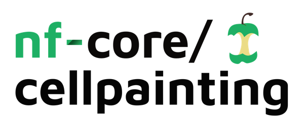
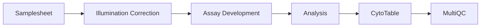

<h1>
  <picture>
    <source media="(prefers-color-scheme: dark)" srcset="docs/images/nf-core-cellpainting_logo_dark.png">
    
  </picture>
</h1>

[](https://github.com/codespaces/new/nf-core/cellpainting)
[](https://github.com/nf-core/cellpainting/actions/workflows/nf-test.yml)
[](https://github.com/nf-core/cellpainting/actions/workflows/linting.yml)[](https://nf-co.re/cellpainting/results)[](https://doi.org/10.5281/zenodo.XXXXXXX)
[](https://www.nf-test.com)

[](https://www.nextflow.io/)
[](https://github.com/nf-core/tools/releases/tag/3.5.1)
[](https://docs.conda.io/en/latest/)
[](https://www.docker.com/)
[](https://sylabs.io/docs/)
[](https://cloud.seqera.io/launch?pipeline=https://github.com/nf-core/cellpainting)

[](https://nfcore.slack.com/channels/cellpainting)[](https://bsky.app/profile/nf-co.re)[](https://mstdn.science/@nf_core)[](https://www.youtube.com/c/nf-core)

## Introduction

**nf-core/cellpainting** is a bioinformatics pipeline for scalable, reproducible image-based profiling of [Cell Painting](https://doi.org/10.1038/nprot.2016.105) assays. It takes high-content microscopy images, applies illumination correction, extracts morphological features with [CellProfiler](https://cellprofiler.org/), and converts the results to analysis-ready [Parquet](https://parquet.apache.org/) files with [CytoTable](https://github.com/cytomining/CytoTable).

The pipeline supports two modes controlled by `--cellprofiler_mode`:

- **`assay_development`** — illumination correction and single-site QC only
- **`analysis`** (default) — full pipeline including feature extraction and format conversion



The pipeline performs the following steps:

1. Compute illumination correction functions per channel and plate ([CellProfiler](https://cellprofiler.org/))
2. Segment a single site per well for visual QC ([CellProfiler](https://cellprofiler.org/))
3. Extract morphological features per site ([CellProfiler](https://cellprofiler.org/)) — `analysis` mode only
4. Convert CellProfiler CSV outputs to Parquet ([CytoTable](https://github.com/cytomining/CytoTable)) — `analysis` mode only
5. Aggregate QC metrics into a report ([MultiQC](https://multiqc.info/))

## Usage

> [!NOTE]
> If you are new to Nextflow and nf-core, please refer to [this page](https://nf-co.re/docs/usage/installation) on how to set-up Nextflow. Make sure to [test your setup](https://nf-co.re/docs/usage/introduction#how-to-run-a-pipeline) with `-profile test` before running the workflow on actual data.

First, prepare a samplesheet with your input data. The samplesheet is in tall format with one row per image:

```csv title="samplesheet.csv"
channel,path,source,batch,plate,well,site,row,col
Mito,/data/images/r01c01f01p01-ch1sk1fk1fl1.tiff,source_4,Batch1,BR00117035,A01,1,1,1
DNA,/data/images/r01c01f01p01-ch5sk1fk1fl1.tiff,source_4,Batch1,BR00117035,A01,1,1,1
ER,/data/images/r01c01f01p01-ch4sk1fk1fl1.tiff,source_4,Batch1,BR00117035,A01,1,1,1
RNA,/data/images/r01c01f01p01-ch3sk1fk1fl1.tiff,source_4,Batch1,BR00117035,A01,1,1,1
AGP,/data/images/r01c01f01p01-ch2sk1fk1fl1.tiff,source_4,Batch1,BR00117035,A01,1,1,1
```

Each row maps a single `.tif`/`.tiff` image to its channel and plate/well/site metadata. See [usage docs](https://nf-co.re/cellpainting/usage) for the full column reference.

Now, you can run the pipeline using:

```bash
nextflow run nf-core/cellpainting \
   -profile <docker/singularity/.../institute> \
   --input samplesheet.csv \
   --outdir <OUTDIR>
```

To run in assay development mode (QC only, no full analysis):

```bash
nextflow run nf-core/cellpainting \
   -profile <docker/singularity/.../institute> \
   --input samplesheet.csv \
   --cellprofiler_mode assay_development \
   --outdir <OUTDIR>
```

> [!WARNING]
> Please provide pipeline parameters via the CLI or Nextflow `-params-file` option. Custom config files including those provided by the `-c` Nextflow option can be used to provide any configuration _**except for parameters**_; see [docs](https://nf-co.re/docs/usage/getting_started/configuration#custom-configuration-files).

For more details and further functionality, please refer to the [usage documentation](https://nf-co.re/cellpainting/usage) and the [parameter documentation](https://nf-co.re/cellpainting/parameters).

## Pipeline output

For more details about the output files and reports, please refer to the
[output documentation](https://nf-co.re/cellpainting/output).

## Credits

nf-core/cellpainting was originally written by [Kenneth Brewer](https://github.com/kenibrewer).

## Contributions and Support

If you would like to contribute to this pipeline, please see the [contributing guidelines](.github/CONTRIBUTING.md).

For further information or help, don't hesitate to get in touch on the [Slack `#cellpainting` channel](https://nfcore.slack.com/channels/cellpainting) (you can join with [this invite](https://nf-co.re/join/slack)).

## Citations

<!-- TODO nf-core: Add citation for pipeline after first release. Uncomment lines below and update Zenodo doi and badge at the top of this file. -->
<!-- If you use nf-core/cellpainting for your analysis, please cite it using the following doi: [10.5281/zenodo.XXXXXX](https://doi.org/10.5281/zenodo.XXXXXX) -->

An extensive list of references for the tools used by the pipeline can be found in the [`CITATIONS.md`](CITATIONS.md) file.

You can cite the `nf-core` publication as follows:

> **The nf-core framework for community-curated bioinformatics pipelines.**
>
> Philip Ewels, Alexander Peltzer, Sven Fillinger, Harshil Patel, Johannes Alneberg, Andreas Wilm, Maxime Ulysse Garcia, Paolo Di Tommaso & Sven Nahnsen.
>
> _Nat Biotechnol._ 2020 Feb 13. doi: [10.1038/s41587-020-0439-x](https://dx.doi.org/10.1038/s41587-020-0439-x).
