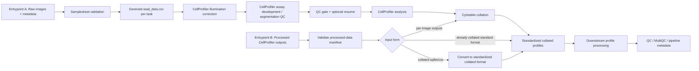

# nf-core/cellpainting: Architecture

## Purpose

This document captures the target architecture for `nf-core/cellpainting` based on the working pipeline code and the design direction agreed across the 2025-2026 dev meetings.

The design goal is to support multiple upstream data states without letting the workflow fragment into unrelated branches. The pipeline should converge early to one standardized internal representation and reuse the same downstream processing path wherever possible.

## Goals

- Support a primary raw-image entrypoint for standard arrayed cell painting.
- Support a secondary processed-data entrypoint for precomputed CellProfiler outputs.
- Converge both paths on one standardized collated profile format.
- Keep CellProfiler integration explicit and reproducible inside Nextflow.
- Preserve room for later downstream expansion (`pycytominer`, additional QC, visualization) without forcing v1 to implement all of it now.

## Non-goals for v1

- Broad support for arbitrary custom CellProfiler pipelines.
- Exhaustive support for all historical collated formats as native first-class inputs.
- Generalized alternate segmentation frameworks in the mainline path.
- Full pooled-cellpainting workflow inside this repo.

## Architecture principles

### 1. One convergence point

Multiple upstream inputs are acceptable. Multiple downstream representations are not.

The architecture should normalize all supported entrypoints to one collated profile format before downstream profile processing. Current meeting consensus points to a `Cytotable`-style collated representation as that convergence point.

### 2. Nextflow owns orchestration

Nextflow should own:

- file staging
- grouping
- fan-out/fan-in
- resumability
- data movement across local and cloud storage

CellProfiler should not be used to compensate for missing orchestration in the workflow.

### 3. Opinionated defaults, override when safe

The pipeline should ship default `cppipe` files and default grouping behavior for standard cell painting. Users may override pipeline files, but the pipeline only guarantees behavior for the documented staged-input contract.

### 4. QC gates before expensive continuation

The pooled-cellpainting work introduced a useful pattern: stop before full continuation, inspect QC, then resume. That pattern should be adopted here, especially around assay development / segmentation validation.

## Target workflow

## Entry points

### Raw images

This is the mainline path.

Expected high-level stages:

- validate tall samplesheet
- generate `load_data.csv`
- run illumination correction
- run assay development
- stop for QC unless explicitly resumed
- run full analysis
- collate with `Cytotable`

### Processed CellProfiler outputs

This is the planned secondary path.

Expected purpose:

- allow teams with existing CellProfiler runs to skip raw image processing
- support preprocessed data from CPG, local storage, or cloud storage
- converge to the same collated representation used downstream

This path should not duplicate downstream logic. Its only job is to validate and normalize upstream processed artifacts.

## Key modules

### Samplesheet / manifest validation

Validates the metadata contract for either entrypoint and converts it into channels that drive grouping.

### `load_data.csv` generation

Generates task-specific `load_data.csv` files from validated metadata.

This is a core architectural seam. Earlier designs used larger reusable subworkflows. Later discussion moved toward generating these files inside tasks from structured metadata to reduce wiring complexity.

### CellProfiler illumination correction

Produces illumination artifacts grouped by `batch + plate + channel`.

### CellProfiler assay development

Runs a small representative segmentation path grouped by `batch + plate + well`, intended for human QC before full analysis.

### QC gate / resume

Stops the workflow after assay-development outputs are ready. Users review segmentation/QC outputs and resume only if acceptable.

### CellProfiler analysis

Runs full segmentation and feature extraction grouped by `batch + plate + well + site`.

### `Cytotable`

Collates CellProfiler outputs into the standardized downstream representation.

This is the intended convergence point for both raw and processed entrypaths.

## Reused design patterns from pooled-cellpainting

- per-task `load_data.csv`
- high parallelism across wells/sites
- manual QC gate before expensive continuation
- parameterized resume workflow
- explicit staging rather than implicit in-tool discovery

These patterns are proven enough to treat them as the default design baseline here.

## Deferred design space

- `pycytominer` subworkflows
- broader format auto-detection for processed entrypoint
- alternate segmentation backends
- richer visualization/report layers
- pooled-specific SBS/barcoding branches

## Current architectural decisions

### Decided

- Use a tall metadata representation for raw-image inputs.
- Group work explicitly in Nextflow rather than relying on CellProfiler internals.
- Use a standardized collated format as the central convergence point.
- Keep raw-image and processed-data entrypoints separate upstream, shared downstream.

### Still open

- Exact v1 scope for processed-data input forms.
- Whether sqlite/csv conversion lives in-pipeline or as a pre-step.
- Where downstream v1 stops: `Cytotable` only, `Cytotable + QC`, or beyond.
