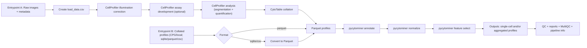

# nf-core/cellpainting: Dev Plan (target: May 2026 dev branch)

## Meeting summary (from thread)

- Keep all major process blocks shown in Excalidraw.
- Add alternate input entrypoint for already-processed experiments.
- Entry for alternate path should start at/near pycytominer (not raw image ingest).
- Support cloud + local paths (Nextflow already handles both).
- Prefer collated data input from CPG when available.
- CPG collated formats are mixed today (mostly SQLite, moving to Parquet, some CSV).
- Keep input formats narrow for v1; add explicit conversion step when needed.

## Agreed scope for next dev milestone

- Two entrypoints:
  - `raw_images` entrypoint (full path from image preprocessing onward).
  - `collated_profiles` entrypoint (skip early CellProfiler path, start downstream).
- Normalize collated input to Parquet before pycytominer steps.
- Include both local filesystem and S3 URIs in validation/tests.

## Workflow map (full component view)

## Component ownership (proposed; confirm in thread)

| Area | Owner(s) | Deliverable for May dev branch |
|---|---|---|
| Alternate entrypoint requirements (`collated_profiles`) | Josh Shapiro, Jaclyn Taroni | Required inputs, accepted formats, acceptance criteria |
| CPG artifact reality check + format policy | Erin Weisbart | Dataset matrix (what exists), recommended v1 format policy |
| Workflow branching + Nextflow plumbing | Florian Wuennemann, Edmund Miller (with Ken Brewer review) | Conditional skip of early path, clean channels from both entrypoints |
| `CellProfiler analysis -> CytoTable` integration | Edmund Miller | Working downstream handoff from full raw path |
| `sqlite/csv -> parquet` converter process | Edmund Miller, Erin Weisbart | Deterministic conversion module + schema checks |
| pycytominer subworkflow modules | Jaclyn Taroni, Josh Shapiro, Edmund Miller | Annotate/normalize/feature-select wired and parameterized |
| Tests (spec + regression) for both entrypoints | Edmund Miller, Florian Wuennemann | Passing nf-test coverage for `raw_images` and `collated_profiles` |
| Docs + workflow diagram sync | Edmund Miller | Updated usage + architecture docs matching implemented behavior |

## Milestones to May 2026 (proposed)

- Mar 18-31: finalize input contract + freeze v1 formats.
- Apr 1-15: implement alternate entrypoint + conversion + channel wiring.
- Apr 16-30: wire pycytominer path + add test data for local/S3.
- May 1-15: stabilize tests/docs, open/maintain working dev branch.

## Open decisions to resolve now

- Exact minimal supported collated inputs for v1 (`parquet` only vs `parquet + sqlite`).
- Whether conversion (`sqlite/csv -> parquet`) is in-pipeline or pre-step script.
- Output mode defaults (`single_cells`, `aggregated`, or both).
- Canonical CPG example dataset(s) for CI-style integration tests.

## Tracking links

- Existing implementation issues: <https://github.com/nf-core/cellpainting/issues>
- Draft workflow board: <https://excalidraw.com/#room=e2233414750a8f9a37d0,hiE3ey9Z9EDs5BaaD9rnmA>
